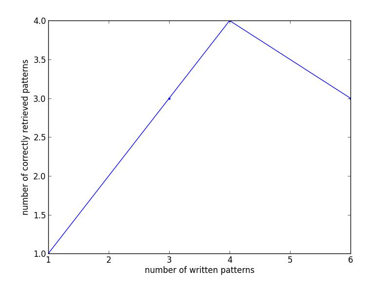
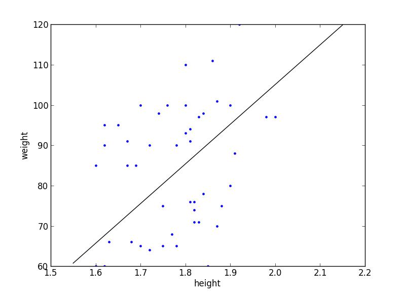
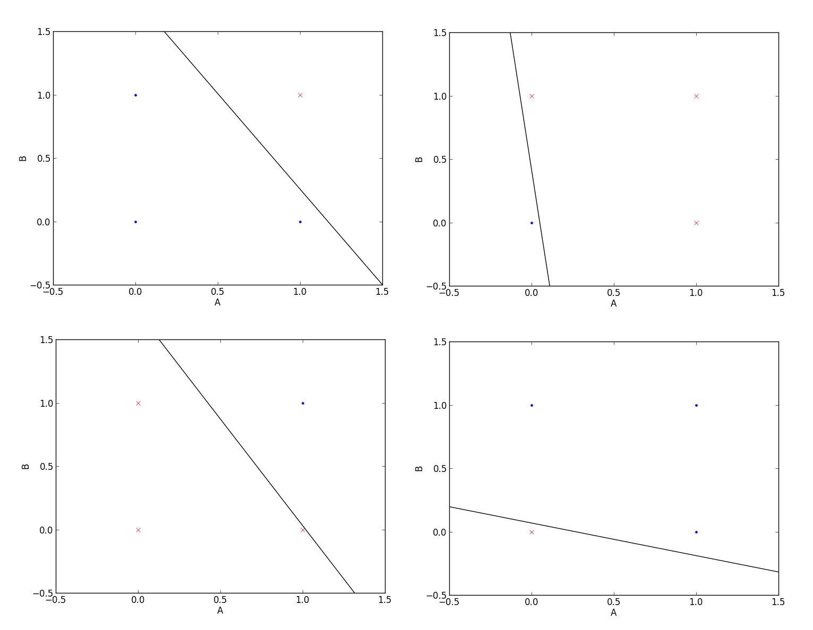

# The memristive Willshaw network and perceptron

This directory includes 2 python codes for simulating the functioning of memristive Willshaw networks and memristive perceptrons, which were created for chapter *"Associative networks and perceptron based on memristors: fundamentals and algorithmic implementation"* of the **"Handbook of Memristor Networks"**, Springer 2018. 

authors: Daniel Silva (djsilva99@gmail.com), Catarina Dias, João Ventura, Paulo Aguiar <br> current version: v0.0.1


## Table of contents

1. [Installation](#installation)
2. [The memristive Willshaw network](#introduction)
3. [The memristive perceptron](#heatcond)


## Installation <a name="installation"></a>

There are two possible ways to run the code. The first is by simply downloading the memristivenetworks folder and by running the .py file, where the simulation conditions are stated and can be changed inside the condition ```if __name__ == "__main__":``` at the end of the file. This condition ensures that the code is only run if the file is run by itself but not if it is imported. The other way is by creating objects and making operations, step by step, in a python shell, which gives a deeper understanding of the algorithm. To import one can either use the python shell inside the memristivenetworks folder or use the pip package management system:

```bash
$ pip install memristivenetworks
```

The following tutorial takes into account that the shell is located inside the memristivenetworks folder. To use the memristivenetworks package installed with pip import both Willshaw and Perceptron classes with:

```python
>>> from memristivenetworks import Willshaw
>>> from memristivenetworks import Perceptron
```


## The memristive Willshaw network <a name="willshaw"></a>

To illustrate with a simple example how a memristor-based Willshaw network works, a simulation example using an algorithm written in python 2.7 is given here. The needed libraries are ```numpy```, ```random``` and ```matplotlib```. The basic example of ```willshaw.py``` allows to go through incremental values of stored patterns up to a maximum defined value (PAmax) and perform averages over many simulations (numberSimulations). In the following tutorial one will create objects and make operations, step by step, by importing the ```willshaw``` subpackage. The defined class called Willshaw allows to create the object network (```__init__```) and make operations with it in a very simple manner (```object.method()```). Opening the python shell in the directory where the .py file is located one must call the Willshaw class with the command ```from willshaw import *``` and initialize one network object using ```Willshaw(NB ,NA, MB, MA)```. The size of the network is set by default to ```NB = NA = 128``` and ```MB = MA = 7```, but other values can be specified. This also creates the matrix that keeps the conductance state of each memristor (0 for high resistances and 1 for low resistances), all initially at zero, and two lists for the associations between population A and population B. Thus, an association dictionary is created as well with two entries: ```’B_neurons’``` and ```’A_neurons’```, empty when initiated. To see the attributed of created objects use object.attribute. For a 4×4 network, with size 2 patterns, we then have:

```python
>>> from willshaw import *
>>> network = Willshaw(NB=4, NA=4, MB=2, MA=2)
>>> network.NB
4
>>> network.MA
2
>>> network.network
array([[ 0., 0., 0., 0.],
[ 0., 0., 0., 0.],
[ 0., 0., 0., 0.],
[ 0., 0., 0., 0.]])
>>> network.associations
{‘B_neurons’: [], ‘A_neurons’: []}
```

The remaining four methods deal with the network store and read operations. The first is the write method and allows the writing of only one association. The respective inputs are two lists, one with the indexes of the population A and the other with the indexes of the population B participating in the association. This method is called inside the second method writeMany that allows the user to write a specified number of associations randomly. The third method is the read method, that gives the indexes of the population B associated with the given input of population A. Once more this is used in the fourth method count, which gives the total number of correctly retrieved patterns (with Hamming distance of 1 or less) at the end of the writing process and the average error value. Then, if we want to write a single given pattern and read it:

```python
>>> network.write([0, 1],[0, 1])
>>> network.network
array([[ 1., 1., 0., 0.],
[ 1., 1., 0., 0.],
[ 0., 0., 0., 0.],
[ 0., 0., 0., 0.]])
>>> network.read([0, 1], threshold=2)
[0, 1]
```

It is clear from the matrix that the pattern was correctly stored. For additional
random multiple patterns:

```python
>>> network.writeMany(2)
([[1, 3], [0, 3]], [[0, 3], [0,2]])
>>> network.associations
{‘B_neurons’: [[0, 1], [1, 3], [0, 3],
‘A_neurons’: [[0, 1], [0, 3], [0, 2]]}
>>> network.network
array([[ 1., 1., 1., 0.],
[ 1., 1., 0., 1.],
[ 0., 0., 0., 0.],
[ 1., 0., 1., 1.]])
>>> out = network.count()
>>> out
(3, 0.0)
>>> network.writeMany(1)
([[0, 1]], [[1, 2]])
>>> network.network
array([[ 1., 1., 1., 0.],
[ 1., 1., 1., 1.],
[ 0., 0., 0., 0.],
[ 1., 0., 1., 1.]])
>>> out = network.count()
>>> out
(4, 0.75)
>>> network.writeMany(2)
([[2, 3]], [[0, 1]], [[0, 3], [2, 3]])
>>> out = network.count()
>>> out
(6, 1.3333333333333333)
```

The number of correct associations and average number of incorrect units as a function of the number of different written associations can be plotted at the end by saving the read output after each write operation, in a similar way to Figs. 4 and 5 in the main text.

```python
>>> x = []
>>> y = []
>>> x.append([1])
>>> y.append(out[1])
>>> out=network.count()
(...)
>>> plt.plot(x,y,'.-'')
>>> plt.xlabel('number of written patterns')
>>> plt.ylabel('number of correctly retrieved patterns')
>>> plt.show()
```



The output Figure shows that all patterns are correctly retrieved up to a maximum of 4 stored patterns, in accordance with the theoretical K<sub>max</sub> = (N<sub>β</sub> N<sub>α</sub> )/(M<sub>β</sub> M<sub>α</sub> ) ln(2) = 2.7. Corrupted and incomplete inputs are given to a not overloaded network in order to test its fault-tolerance.

```python
>>> network = Willshaw(NB=4, NA=4, MB=2, MA=2)
>>> network.writeMany(2)
([[0, 2], [1, 3]], [[0, 2], [0, 2]])
>>> network.read([0, 2], 2)
[0, 2]
>>> network.read([0, 1], 2)
[0, 2]
>>> network.read([0], threshold=2)
[0]
>>> network.read([0], threshold=1)
[0, 2]
```

The ```threshold``` needs to be lowered (1 in this case) to take into account the defects on the input pattern.


## The memristive perceptron <a name="perceptron"></a>

To illustrate with a simple example of how a memristor-based perceptron works, a simulation example using an algorithm written in python 2.7 is given here. The needed libraries are ```numpy```, ```matplotlib```, ```pylab``` and ```csv```. In the following tutorial one will create objects and make operations, step by step, by importing the ```perceptron``` subpackage.

Opening the python shell in the directory where the .py file is located one must use the command ```from perceptron import *```. To import data from a .csv file or randomly generate data for the weight/height classification example used in the main text, a class called Data was created. If an input file (e.g. ‘BMI.data.csv’) is given, the respective ```__init__``` function converts the first N-1 elements of  each row of length N to floating point format and creates a dictionary between the two possible last values (usually in the string format) and the integers ‘0’ and ‘1’, in order to perform calculations. If there is no input file, a given number (```npoints```, set to 20 by default) of pairs (weight, height) are randomly generated, using the BMI=25 criteria for group separation. The function ```folds``` separates the data into the training (```training_data```) and test (```test_data```) datasets, of sizes (1-1/k) and 1/k of total data size, respectively. 

```python
>>> from perceptron import *
>>> data = Data(filename='BMI.data.csv')
Dictionary: {'O': 0, 'N': 1}
>>> len(data.dataset)
46
>>> data.folds(5)
>>> len(data.training_data)
36
>>> len(data.test_data)
9
```

The conductance variation values are given by the class SetReset, whose object loads the data of the conductance variation as a function of the actual conductance from a .csv file (conductance in the first column and conductance variation in the second). Function deltaG returns the interpolation of the conductance variation for a given conductance. The network object is created by the class Perceptron, initialized (__init__) by the number of input neurons (NA; 2 by default ), the number of output neurons (NB; 1 by default ), bias constant input (1 by default) and Set and Reset conductance change file names (‘set.csv’ and ‘reset.csv’ by default, respectively). It creates two matrixes, A_memristors and B_memristors, that represents all the pairs of weights mentioned in the last section. Empty lists to save the errors at present iteration (```errors```), errors history (```errorshist```), weights history (```Ahist``` and ```Bhist```) and voltage pulses (VA and
VB) are also created.

```python
>>> network = Perceptron(NA=2, NB=1, bias=1,
setFileName='set.csv', resetFileName='reset.csv')
>>> network.A_memristors
array([[ 0.82141779],
[ 0.68005111],
[ 0.17115392])
>>> network.errors
[]
```

Four remaining methods perform the perceptron training and classify operations. The first is the train method that allows the training of the perceptron by weight actualization. The input is the index (iteration) of the pattern (inputs and expected value) to compute in the training data list. This method is called inside the second method trainMany that allows one to train the perceptron under a set of data and over a given number of iterations (n_epoch). Therefore, the set of data to train and the number of iterations are the inputs. The third is the read method, that gives the classification of the data in the form of 0 or 1. Once more this is used in the fourth method readMany, which updates the list errors with the number of errors for each test pattern in the list test_data give as input. An additional method (eq_hyperplane) gives the 2D equation of the hyperplane for visualization purposes.

```python
>>> network. trainMany(data.training_data,
numberIterations=25,l_rate=0.1)
>epoch = 1, lrate = 0.100, error = 15
>epoch = 2, lrate = 0.100, error = 16
>epoch = 3, lrate = 0.100, error = 16
>epoch = 4, lrate = 0.100, error = 16
>epoch = 5, lrate = 0.100, error = 18
>epoch = 6, lrate = 0.100, error = 10
>epoch = 7, lrate = 0.100, error = 6
>epoch = 8, lrate = 0.100, error = 6
>epoch = 9, lrate = 0.100, error = 6
>epoch = 10, lrate = 0.100, error = 6
>epoch = 11, lrate = 0.100, error = 6
>epoch = 12, lrate = 0.100, error = 6
>epoch = 13, lrate = 0.100, error = 6
>epoch = 14, lrate = 0.100, error = 6
>epoch = 15, lrate = 0.100, error = 6
>epoch = 16, lrate = 0.100, error = 2
>epoch = 17, lrate = 0.100, error = 0
>epoch = 18, lrate = 0.100, error = 0
>epoch = 19, lrate = 0.100, error = 0
>epoch = 20, lrate = 0.100, error = 0
>epoch = 21, lrate = 0.100, error = 0
>epoch = 22, lrate = 0.100, error = 0
>epoch = 23, lrate = 0.100, error = 0
>epoch = 24, lrate = 0.100, error = 0
>epoch = 25, lrate = 0.100, error = 0
>>> network.readMany(data.test_data)
Correct tested patterns: 100.0 %
>>> network.errors
[0.0, 0.0, 0.0, 0.0, 0.0, 0.0, 0.0, 0.0, 0.0]
>>> height = [i[0][0] for i in data.dataset]
>>> weight = [i[0][1]*100 for i in data.dataset]
>>> plt.plot(height,weight,'.')
>>> plt.plot(np.arange(1.55,2.2,.2),
network.eq_hyperplane(np.arange(1.55,2.2,.2))*100,'-k')
>>> plt.xlabel('height')
>>> plt.ylabel('weight')
>>> plt.show()
```



Other straightforward test to check if the algorithm is working can be performed using the linearly separable logic gates (AND and OR, and obviously, NAND and OR). The Boolean functions are summarized in the following table:

|  A  |  B  | A AND B | A OR B | A NAND B | A NOR B |
|:---:|:---:|:-------:|:------:|:--------:|:-------:|
|  0  |  0  |    0    |    0   |     1    |    1    |
|  0  |  1  |    0    |    1   |     1    |    0    |
|  1  |  0  |    0    |    1   |     1    |    0    |
|  1  |  1  |    1    |    1   |     0    |    0    |

The classification of these logical operations is shown below. This shows that the memristive perceptron is able implement logical operations, computing binary inputs to produce a single binary output.



----------------------